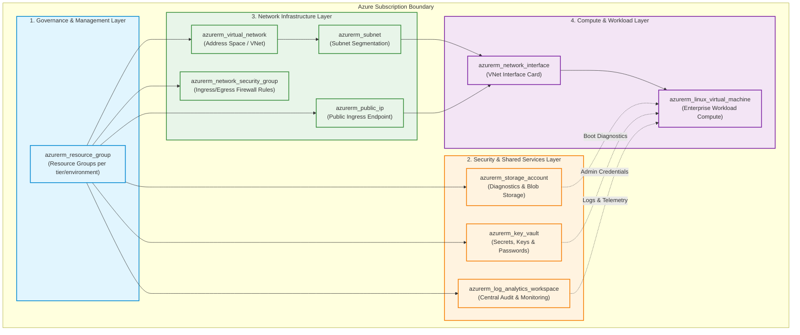
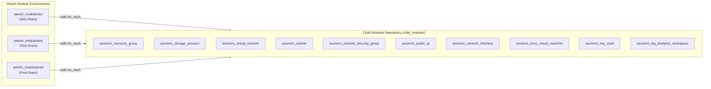

# Azure Landing Zone Architecture & Resource Provisioning Flow

This document provides a complete guide to the enterprise **Azure Landing Zone Architecture** implemented in this repository (`parent-child-10-modules-azure`). It details how the **10 Azure Child Modules** interlink across 4 architecture layers to establish a secure, scalable, and automated cloud environment for `dev`, `test`, and `prod`.

---

## 1. High-Level Azure Landing Zone Blueprint

The Landing Zone design follows the **Microsoft Cloud Adoption Framework (CAF)** principles, separating governance, security, networking, and compute into distinct operational tiers:



---

## 2. Resource Execution Sequence & Dependency Flow

Terraform provisions resources strictly following the logical dependency tree below. Parent modules enforce explicit `depends_on` blocks to guarantee order of execution during `terraform apply`:

```
========================================================================================
                               RESOURCE PROVISIONING FLOW
========================================================================================

STEP 1: RESOURCE GROUP
  └── azurerm_resource_group
        │
        ├──► STEP 2: SHARED SERVICES & NETWORK FOUNDATION (Parallel Execution)
        │     ├── azurerm_log_analytics_workspace (Audit & Diagnostics Hub)
        │     ├── azurerm_key_vault               (Secrets & Identity Encryption)
        │     ├── azurerm_storage_account         (Storage & Diagnostics)
        │     ├── azurerm_virtual_network         (Network Address Space)
        │     ├── azurerm_network_security_group (Firewall Rules)
        │     └── azurerm_public_ip               (Public IP Allocation)
        │
        ├──► STEP 3: NETWORK SUBNETTING (Requires Virtual Network)
        │     └── azurerm_subnet                  (Subnet Slicing within VNet)
        │
        ├──► STEP 4: NETWORK INTERFACE (Requires Subnet + Public IP)
        │     └── azurerm_network_interface       (Binds Subnet IP + Public IP)
        │
        └──► STEP 5: COMPUTE WORKLOAD (Requires NIC + Storage + Key Vault)
              └── azurerm_linux_virtual_machine   (Deploy Linux Compute Instance)
========================================================================================
```

---

## 3. Detailed 10-Child-Module Breakdown

| Layer | Child Module Folder | Primary Resource | Input Dependency | Output / Downstream Consumer |
| :--- | :--- | :--- | :--- | :--- |
| **1. Governance** | [`azurerm_resource_group`](file:///c:/DevOps%20Insiders/Terraform/parent-child-10-modules-azure/child_module/azurerm_resource_group) | `azurerm_resource_group` | None (Root container) | Used by all 9 remaining child modules |
| **2. Security & Shared** | [`azurerm_log_analytics_workspace`](file:///c:/DevOps%20Insiders/Terraform/parent-child-10-modules-azure/child_module/azurerm_log_analytics_workspace) | `azurerm_log_analytics_workspace` | Resource Group | Collects diagnostic logs from VMs, Network, KV |
| | [`azurerm_key_vault`](file:///c:/DevOps%20Insiders/Terraform/parent-child-10-modules-azure/child_module/azurerm_key_vault) | `azurerm_key_vault` | Resource Group | Stores VM Admin Credentials and SSH keys |
| | [`azurerm_storage_account`](file:///c:/DevOps%20Insiders/Terraform/parent-child-10-modules-azure/child_module/azurerm_storage_account) | `azurerm_storage_account` | Resource Group | VM Boot Diagnostics, Storage Blobs, Disks |
| **3. Network** | [`azurerm_virtual_network`](file:///c:/DevOps%20Insiders/Terraform/parent-child-10-modules-azure/child_module/azurerm_virtual_network) | `azurerm_virtual_network` | Resource Group | Defines `address_space` for subnets |
| | [`azurerm_subnet`](file:///c:/DevOps%20Insiders/Terraform/parent-child-10-modules-azure/child_module/azurerm_subnet) | `azurerm_subnet` | Virtual Network | Provides IP range for NICs |
| | [`azurerm_network_security_group`](file:///c:/DevOps%20Insiders/Terraform/parent-child-10-modules-azure/child_module/azurerm_network_security_group) | `azurerm_network_security_group` | Resource Group | Security rules applied to Network Interfaces / Subnets |
| | [`azurerm_public_ip`](file:///c:/DevOps%20Insiders/Terraform/parent-child-10-modules-azure/child_module/azurerm_public_ip) | `azurerm_public_ip` | Resource Group | Allocated public IP attached to Network Interface |
| **4. Compute** | [`azurerm_network_interface`](file:///c:/DevOps%20Insiders/Terraform/parent-child-10-modules-azure/child_module/azurerm_network_interface) | `azurerm_network_interface` | Subnet, Public IP | Network adapter for Virtual Machine |
| | [`azurerm_linux_virtual_machine`](file:///c:/DevOps%20Insiders/Terraform/parent-child-10-modules-azure/child_module/azurerm_linux_virtual_machine) | `azurerm_linux_virtual_machine` | Network Interface, Storage | Runs application workloads |

---

## 4. Multi-Environment Parent Module Architecture

The environment configurations in `parent_module/` (`dev`, `prod`, `test`) reuse the same set of 10 child modules by feeding environment-specific values via `terraform.tfvars`:



---

## 5. Deployment Instructions

To deploy the Landing Zone for any target environment (e.g., `dev`):

```bash
# 1. Navigate to target environment parent directory
cd parent_module/dev

# 2. Initialize Terraform modules and Azure provider
terraform init

# 3. Validate code formatting and variables
terraform validate

# 4. Generate & inspect the execution plan
terraform plan

# 5. Apply infrastructure rollout
terraform apply --auto-approve
```
