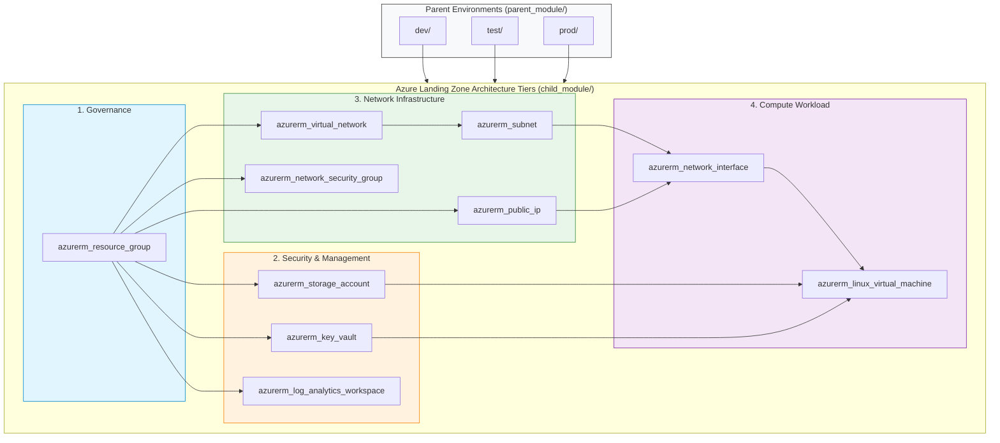

# Architecture Diagram - Restructured Azure Parent-Child Landing Zone

This document details the updated 2-folder architecture with `child_module` (10 Azure child modules) and `parent_module` (`dev`, `prod`, `test` environments) aligned with the **Azure Landing Zone Architecture**.

For full documentation and provisioning sequence details, see [`LANDING_ZONE_ARCHITECTURE.md`](file:///c:/DevOps%20Insiders/Terraform/parent-child-10-modules-azure/LANDING_ZONE_ARCHITECTURE.md).

---

## 1. Erasor.io Markup Syntax

Copy and paste into [Erasor.io](https://app.erasor.io/):

```erasor
// Azure Landing Zone Architecture Layers
Azure Landing Zone [icon: azure] {
  Governance Tier [icon: folder] {
    azurerm_resource_group [icon: azure-resource-groups]
  }
  
  Security & Shared Services Tier [icon: folder] {
    azurerm_log_analytics_workspace [icon: azure-log-analytics]
    azurerm_key_vault [icon: azure-key-vaults]
    azurerm_storage_account [icon: azure-storage-accounts]
  }
  
  Network Infrastructure Tier [icon: folder] {
    azurerm_virtual_network [icon: azure-virtual-networks]
    azurerm_subnet [icon: azure-subnets]
    azurerm_network_security_group [icon: azure-network-security-groups]
    azurerm_public_ip [icon: azure-public-ips]
  }
  
  Compute Workload Tier [icon: folder] {
    azurerm_network_interface [icon: azure-network-interfaces]
    azurerm_linux_virtual_machine [icon: azure-virtual-machines]
  }
}

// Parent Environment Management
Parent Module [icon: folder] {
  dev [icon: folder]
  test [icon: folder]
  prod [icon: folder]
}

// Relationships
Parent Module > Azure Landing Zone
Azure Landing Zone.Governance Tier > Azure Landing Zone.Security & Shared Services Tier
Azure Landing Zone.Governance Tier > Azure Landing Zone.Network Infrastructure Tier
Azure Landing Zone.Network Infrastructure Tier > Azure Landing Zone.Compute Workload Tier
Azure Landing Zone.Security & Shared Services Tier > Azure Landing Zone.Compute Workload Tier
```

---

## 2. Mermaid Landing Zone Dependency Graph


